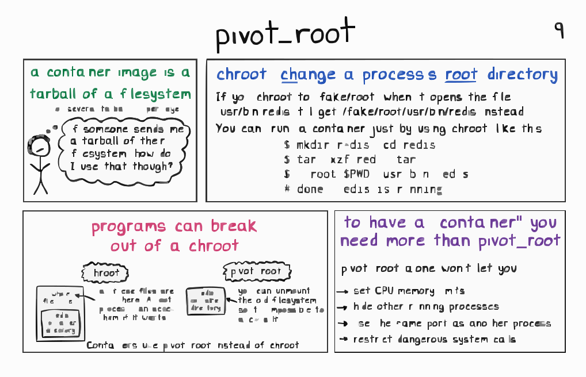
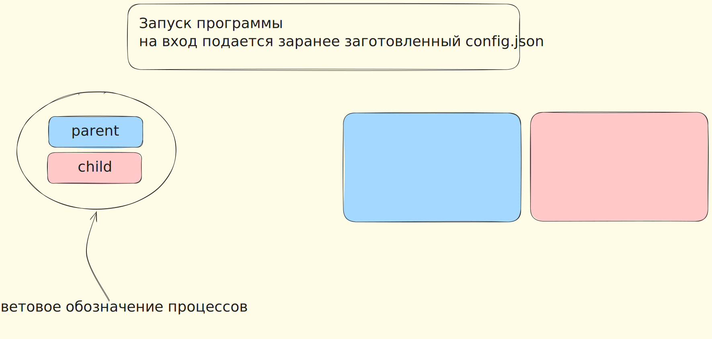

# devops-elective-itmo-2026-1lab

[](https://golang.org/)
[](https://www.kernel.org/)
[](https://github.com/apartapatia/devops-elective-itmo-2026-1lab/actions/workflows/ci.yml)
[](https://github.com/apartapatia/devops-elective-itmo-2026-1lab/actions/workflows/ci.yml)
# Отчет по работе


## Список вопросов для самостоятельного исследования и ответов

запуск как parent потом как child?

можно ли считывать namespace прямо из runc?

```
		"namespaces": [
			{
				"type": "pid"
			},
			{
				"type": "network"
			},
			{
				"type": "ipc"
			},
			{
				"type": "uts"
			},
			{
				"type": "mount"
			},
			{
				"type": "cgroup"
			}
		],
```
вот часть runc, в которой выписаны нужные неймспейсы. можем ли просто считать их и не хардкодить их,или будет меняться значение постоянно в спеке или не быть главных в спеке...


defer нужно ли через него что-то чистить после остановки контейнеров


chroot vs pivot_root очень интересно но не понятно)



# Иллюстрация к работе кода



# Источники

https://github.com/lizrice/containers-from-scratch/blob/master/main.go

https://www.youtube.com/watch?v=8fi7uSYlOdc

https://github.com/jvns </3
